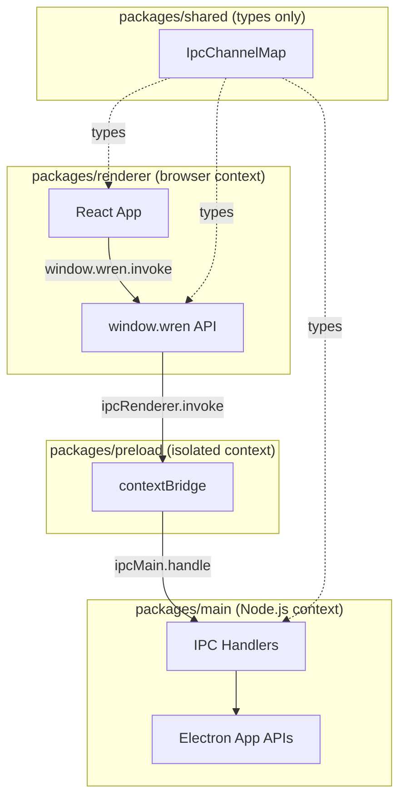

# Wren IDE

> **Your keys. Your models. Your workspace.**

Wren is a BYOK-first, multi-provider AI, multi-project desktop IDE built with Electron + React + TypeScript.

---

## Prerequisites

| Tool    | Version |
|---------|---------|
| Node.js | ≥ 20    |
| pnpm    | ≥ 9     |

Install pnpm if needed:

```bash
npm install -g pnpm
```

---

## Setup

```bash
# Install all dependencies (all packages resolved via pnpm workspaces)
pnpm install
```

---

## Development

```bash
pnpm dev
```

This starts:
1. **Vite dev server** for the renderer at `http://localhost:5173` (with HMR)
2. **TypeScript compilation** for `main`, `preload`, and `shared`
3. **Electron** loading the Vite URL

The app window opens automatically. Edit files in `packages/renderer/src` and changes reflect instantly via hot reload.

---

## Build

```bash
pnpm build
```

Compiles all packages in dependency order:
1. `@wren/shared` → TypeScript types + IPC contracts
2. `@wren/preload` → Electron contextBridge script
3. `@wren/main` → Electron main process
4. `@wren/renderer` → React app via Vite

---

## Distribution

```bash
pnpm dist
```

Runs `pnpm build` then `electron-builder`. Outputs to `release/`.

Targets by platform:
- **macOS**: `.dmg` (arm64 + x64)
- **Windows**: NSIS installer (x64)
- **Linux**: AppImage (x64)

---

## Lint

```bash
pnpm lint
```

---

## Project Structure

```
wren/
├── packages/
│   ├── main/          # Electron main process (Node.js context)
│   │   └── src/
│   │       └── index.ts   # App lifecycle, BrowserWindow, IPC handlers
│   ├── renderer/      # React frontend (browser context)
│   │   ├── src/
│   │   │   ├── main.tsx       # React entry point
│   │   │   ├── App.tsx        # Root component
│   │   │   └── wren.d.ts      # window.wren type augmentation
│   │   ├── index.html
│   │   └── vite.config.ts
│   ├── shared/        # Shared types and IPC channel contracts
│   │   └── src/
│   │       ├── ipc.ts         # IpcChannelMap — source of truth for all IPC
│   │       └── index.ts
│   └── preload/       # Electron preload script (contextBridge)
│       └── src/
│           └── index.ts       # Exposes window.wren with type-safe invoke()
├── scripts/
│   └── dev.mjs        # Dev orchestrator (Vite + Electron)
├── electron-builder.yml
├── eslint.config.mjs
├── .prettierrc
├── tsconfig.base.json
└── package.json       # Workspace root, shared dev dependencies
```

---

## Architecture



### Security Model

- `contextIsolation: true` — renderer runs in isolated context
- `nodeIntegration: false` — renderer has no Node.js access
- `sandbox: true` — renderer process sandboxed
- All IPC goes through `contextBridge.exposeInMainWorld` → no direct Node.js in renderer

### Adding a New IPC Channel

1. Add the channel to `packages/shared/src/ipc.ts`:

```typescript
export interface IpcChannelMap {
  "my:channel": {
    request: { param: string };
    response: { result: number };
  };
  // ...existing channels
}
```

2. Register the handler in `packages/main/src/index.ts`:

```typescript
handle("my:channel", (_event, { param }) => {
  return { result: param.length };
});
```

3. Call it from the renderer:

```typescript
const { result } = await window.wren.invoke("my:channel", { param: "hello" });
```

TypeScript enforces correct payload shapes end-to-end — no `any` casts needed.

---

## Naming Conventions

| Area           | Convention                                      |
|----------------|-------------------------------------------------|
| Files          | `kebab-case.ts` for utilities, `PascalCase.tsx` for React components |
| Components     | `PascalCase`, one component per file             |
| CSS Modules    | `Component.module.css`, classes in `camelCase`   |
| IPC channels   | `domain:action` (e.g., `app:get-version`)        |
| Package names  | `@wren/<name>`                                   |

---

## License

Private — all rights reserved.
