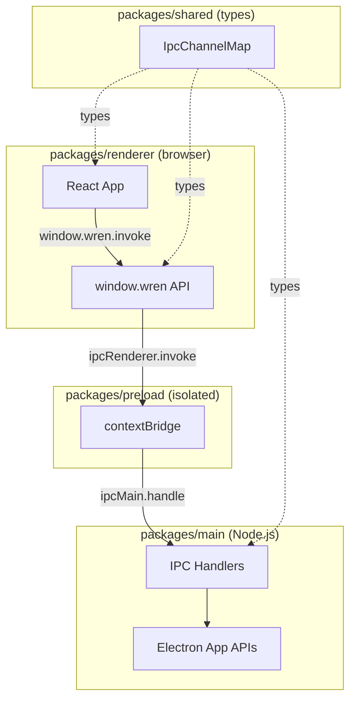

<div align="center">

# Wren IDE

**Your Keys. Your Models. Your Workspace.**

The AI-native desktop IDE for serious developers — multi-model, multi-project, zero lock-in.

[](#)
[](#)
[](https://www.electronjs.org/)

[Download](#installation) · [Quick Start](#quick-start) · [BYOK Setup](#byok-setup) · [Docs](#documentation) · [Discord Community](#community)

</div>

---

## What is Wren?

Wren is a desktop IDE built on a single principle: **you own your AI stack**.

- **Bring Your Own Keys** — connect directly to Claude, GPT-4, Mistral, Gemini. No proxy, no markup.
- **Multi-model** — switch models per task, per project, per conversation.
- **Multi-project** — manage multiple codebases from a single workspace hub.
- **Agentic** — not just autocomplete. Full agent loops with context awareness.
- **Private** — your code never touches our servers. Your keys, your calls.

---

## Installation

### Download (Recommended)

| Platform | Download |
|----------|----------|
| macOS (Apple Silicon) | [Wren-0.1.0-arm64-mac.zip](https://github.com/ObbyVR/wren/releases/latest/download/Wren-0.1.0-arm64-mac.zip) |
| macOS (Intel) | [Wren-0.1.0-mac.zip](https://github.com/ObbyVR/wren/releases/latest/download/Wren-0.1.0-mac.zip) |
| Windows (x64, portable) | [Wren-0.1.0-win.zip](https://github.com/ObbyVR/wren/releases/latest/download/Wren-0.1.0-win.zip) |
| Linux (x64) | [Wren-0.1.0.AppImage](https://github.com/ObbyVR/wren/releases/latest/download/Wren-0.1.0.AppImage) |

Browser Bridge extension: [Chrome](https://github.com/ObbyVR/wren/releases/latest/download/wren-nexus-bridge-0.1.0.zip) · [Firefox](https://github.com/ObbyVR/wren/releases/latest/download/wren-nexus-bridge-0.1.0-firefox.zip)

### Build from Source

**Prerequisites:**

| Tool | Version |
|------|---------|
| Node.js | ≥ 20 |
| pnpm | ≥ 9 |

```bash
# Install pnpm if needed
npm install -g pnpm

# Clone and install
git clone https://github.com/your-org/wren.git
cd wren
pnpm install

# Run in development mode
pnpm dev

# Build for distribution
pnpm dist
```

---

## Quick Start

1. **Download and install** Wren for your platform
2. **Open Wren** — you'll see the onboarding wizard
3. **Add your first AI key** (see [BYOK Setup](#byok-setup) below)
4. **Create a project** — point Wren to your codebase
5. **Start coding** with AI assistance

---

## BYOK Setup

Wren never stores your keys on our servers. Keys are stored locally, encrypted.

### Supported Providers

| Provider | Models | Get API Key |
|----------|--------|-------------|
| Anthropic | Claude Sonnet 4.6, Opus, Haiku | [console.anthropic.com](https://console.anthropic.com) |
| OpenAI | GPT-4o, GPT-4o-mini, o1-mini | [platform.openai.com](https://platform.openai.com) |
| Google | Gemini 2.0 Flash, 1.5 Pro | [aistudio.google.com](https://aistudio.google.com) |
| Mistral | Large, Medium, Small, Codestral | [console.mistral.ai](https://console.mistral.ai) |

### How to Add a Key

1. Open Wren → **Settings** → **AI Providers**
2. Click **Add Provider**
3. Select your provider from the list
4. Paste your API key — it's validated instantly
5. Set as default or assign to specific projects

**Cost tip:** Claude 3.5 Haiku and GPT-4o-mini are ideal for quick completions. Reserve the bigger models for complex agent tasks.

---

## Documentation

- [Getting Started Guide](docs/getting-started.md) — First project in 5 minutes
- [API Reference](docs/api-reference.md) — Typed IPC channels
- [Changelog](docs/changelog.md) — What shipped when
- [Roadmap](docs/roadmap.md) — What's next
- [FAQ](docs/faq.md) — Top questions answered
- [Privacy](site/privacy.html) · [Terms](site/terms.html)

---

## Community

Join the Wren Discord — the place to get help, share what you've built, and stay updated.

**→ [discord.gg/wren](#)** _(link coming soon)_

Channels you'll use most:
- `#help` — setup questions, troubleshooting
- `#showcase` — show what you've built
- `#byok-tips` — share provider configs and cost optimization tips
- `#announcements` — release notes and roadmap updates

---

## Development

```bash
# Install dependencies
pnpm install

# Development mode (HMR + hot reload)
pnpm dev

# Build all packages
pnpm build

# Build distributable installer
pnpm dist

# Lint
pnpm lint
```

### Project Structure

```
wren/
├── packages/
│   ├── main/       # Electron main process (Node.js)
│   ├── renderer/   # React frontend (browser context)
│   ├── shared/     # Shared types and IPC contracts
│   └── preload/    # Electron contextBridge
├── docs/           # User documentation
├── site/           # Landing page
└── scripts/        # Build and dev orchestration
```

### Architecture



**Security model:** `contextIsolation: true`, `nodeIntegration: false`, `sandbox: true` — renderer is fully sandboxed.

### Adding a New IPC Channel

1. Define in `packages/shared/src/ipc.ts`:

```typescript
export interface IpcChannelMap {
  "my:channel": {
    request: { param: string };
    response: { result: number };
  };
}
```

2. Register handler in `packages/main/src/index.ts`:

```typescript
handle("my:channel", (_event, { param }) => {
  return { result: param.length };
});
```

3. Call from renderer:

```typescript
const { result } = await window.wren.invoke("my:channel", { param: "hello" });
```

TypeScript enforces correct payload shapes end-to-end.

---

## Naming Conventions

| Area | Convention |
|------|-----------|
| Files | `kebab-case.ts` for utilities, `PascalCase.tsx` for React components |
| Components | `PascalCase`, one component per file |
| CSS Modules | `Component.module.css`, classes in `camelCase` |
| IPC channels | `domain:action` (e.g., `app:get-version`) |
| Package names | `@wren/<name>` |

---

## License

Private — all rights reserved.
